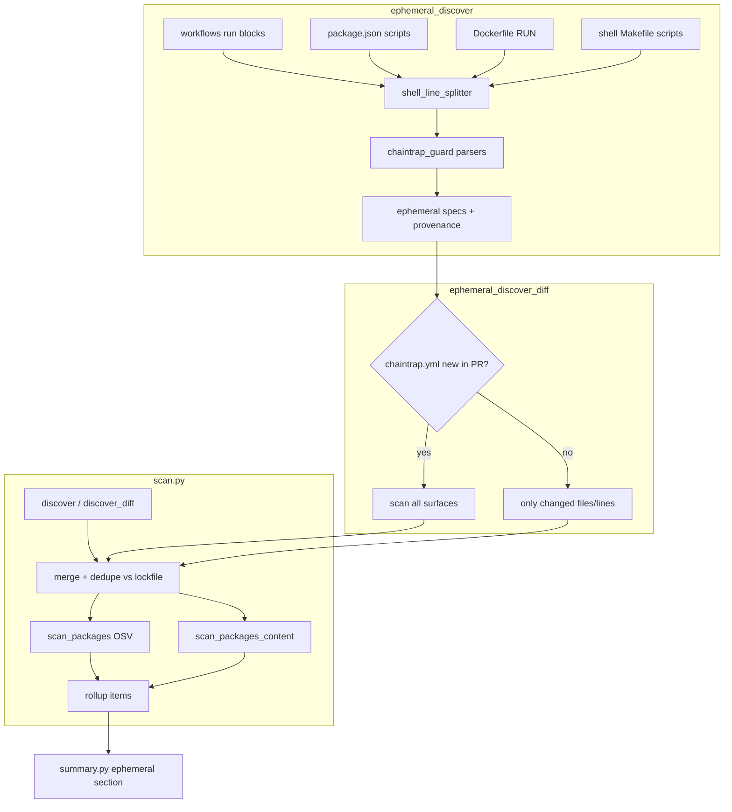

# Ephemeral dependency discovery (v1.4)

Architecture and implementation notes for Chaintrap scan-action v1.4.0.

## Problem

Lockfile SCA misses **shadow dependencies**: packages installed inline in CI (`npx evil@1.0.0`, `pip install foo==1.0.0`, `uvx ruff@0.4.0`) that never appear in `package-lock.json`, `uv.lock`, or manifests.

## Solution overview



## Modules

| Module | Role |
| --- | --- |
| `vendor/chaintrap-guard` | Vendored parsers: `npx`, `pip`, `uv`, `uvx`, `pipx`, `pnpm/yarn dlx`, `bunx` |
| `ephemeral_shell.py` | Split compound shell lines; route argv to guard |
| `ephemeral_discover.py` | Enumerate candidate files; extract specs + provenance |
| `ephemeral_discover_diff.py` | PR diff vs bootstrap-on-first-Chaintrap-PR |
| `scan.py` | Merge after lockfile discover; shared `max_packages` cap |
| `summary.py` | Collapsible *Ephemeral dependencies* section |

## Discovered item shape

```python
{
  "ecosystem": "npm" | "pypi",
  "package_spec": "name@version",
  "resolution_source": "ephemeral",
  "ephemeral_source": {
    "file": ".github/workflows/ci.yml",
    "line": 42,
    "kind": "workflow" | "package_json_script" | "dockerfile" | "shell",
    "command": "npx -y evil-pkg@1.0.0"
  },
  "ephemeral_unpinned": false
}
```

Unpinned installs use `name@unknown` and warn only (no block).

## Scan surfaces

| Surface | Pattern |
| --- | --- |
| `.github/workflows/*.{yml,yaml}` | `run:` blocks (reuse `workflow_audit._iter_run_blocks`) |
| `**/package.json` | `scripts` values only |
| `Dockerfile`, `**/Dockerfile*` | `RUN ...` lines |
| `Makefile`, `**/*.mk`, `**/*.sh` | Lines matching install patterns (max 50 files) |

Skipped: `node_modules`, `.venv`, `vendor/`, `git+` URLs, `pip install .`, `-e .`

## PR behavior

| Scenario | Ephemeral scan scope |
| --- | --- |
| Normal PR | Changed ephemeral candidate files only |
| First Chaintrap PR (new `chaintrap.yml` or new `uses: chaintrap-sec/scan-action`) | Full baseline of all surfaces |
| Push / non-PR | Full ephemeral scan (when enabled) |

## Gates and blocking

| Finding | Action |
| --- | --- |
| Known malicious / IOC / denylist | Block |
| Ephemeral + HIGH/CRITICAL content scan | Block |
| Unpinned ephemeral | Warn |
| Already in lockfile | Hidden |

## Configuration

**Action input:** `ephemeral-scan: true|false` (default `true`)

**`.chaintrap.yml`:**

```yaml
gates:
  ephemeral_scan: true
```

## Tests

- `tests/test_ephemeral_discover.py` — unit + integration
- `test_fixtures/ephemeral_deps/` — workflow, Dockerfile, shell, dedup, bootstrap fixtures
- CI job `dogfood-ephemeral` — blocks known-bad `npx nx@20.9.0`

## Out of scope (v1.4)

- Full shell parser / dynamic `$(cat pkg.txt)` expansion
- `conda`, `poetry run` chains
- Native PR comment step (use existing `github-script` pattern)

## Syncing chaintrap-guard

After changing parsers in `extension-analyser/packages/chaintrap-guard`, copy the package to `vendor/chaintrap-guard/` before release.
